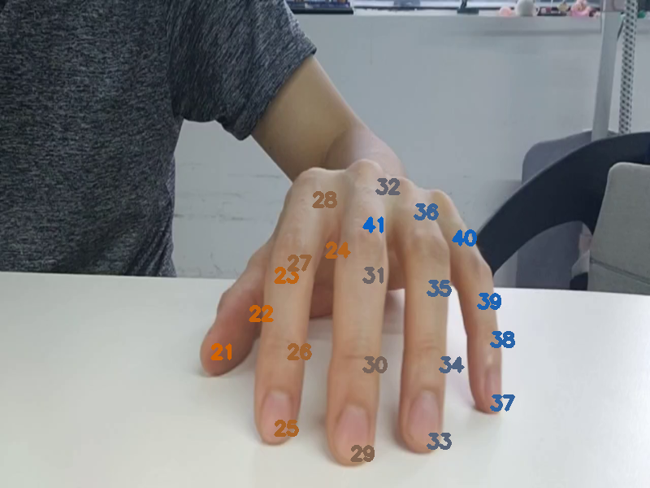
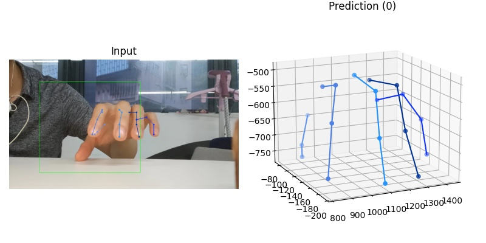

# Play piano by a table with keypoint hand pose 基于实时手部关键点识别实现在平面上弹钢琴

# Introduction

配置好环境，在平面上放上一个摄像头，运行程序，让我们弹奏一首欢乐颂吧~
 
> 直接上视频

B站地址：https://www.bilibili.com/video/BV1wT411g7MU/

# Quickstart

## A.Environment 配置环境

1. 从github或gitee上clone MMpose项目到本地,并安装必须的库:

    git clone clone https://github.com/open-mmlab/mmpose.git
    cd mmpose
    python setup.py install

2.把本仓库内所有文件全部复制到mmpose/demo文件夹下。

3. 在mmpose/demo文件夹中运行 mainMulti.py文件（python mainMulti.py)

4. 若要修改使用摄像头画面或视频文件,修改预览画面大小，跳帧数,可修改initParam.py, 

5. 本项目中，暂时设定了右手的 拇指到尾指分别对应 do ,re ,mi ,fa ,sol 这5个音。

6. 因要实现弹钢琴的效果，摄像头放置于图示位置是最好的。而摄像头不能太高，否则摄像头拍摄角度太大，导致手指尖上下移动的变化就不明显。但可以适当向下倾，有利于模型识别。

7.摄像头可选用普通usb网络摄像头。最好清晰度能高一点，不要有畸变的。我这里选用手机前置摄像头录了一段视频

## B. Parameter setting

1.设置link来设置输入图片的来源，如视频则为视频地址：link='./pianoSound/hand6.mp4'，若拿摄像头画面则设为摄像头对应id，如：link=0

2.设置wSize=800，hSize=450 来设置获取图片的宽高

3 rangeIndexList=[0.45,0.59,0.55,0.5,0.5]分别代表拇指，食指，中指，无名指，尾指的按键响应区域在纵坐标方向的大小。使用时需先进行校准，这与校准参数有关【详见下一节校准】。

4.skipFrmae=1即不跳帧处理，skipFrame=3则代表每3帧处理一帧

## C. Run

### 1. 确认安装好对应的库

### 2. 运行mainMultiThread.py

启动后，pygame会启动一个新窗口，并显示视频或摄像头画面。这时需要进行校准。

### 3. 校准：

3.1 五指放于桌面上，对应5只手指都按下琴键，如下图，这时识别正常后按键盘方向键下，获取指尖在桌面位置。

成功后会标示下限位置，对应代码中的ftDown1（右手）或ftDown2（左手），暂时只支持同一时间只有一只手。

 3.2 同时抬起5只手指，对应5只手指都没有按下琴键，并按键盘的上方向键
 

3.3 这时若出现如上图的矩形即校准成功。矩形为指尖响应区，即指尖到这里就会响起对应的声音。

> 只需关注纵向位置，横向位置可忽略，即指尖只需落在响应区矩形的上横线与下横向之间即可，不用落在左右竖线之间）

3.4 设置rangeIndexList，list中的5个值分别对应拇指，食指，中指，无名指，尾指的响应区大小，为1则从校准时最低到校准时手指的最高处，所以正常在0.4~0.5附近这里给出一定参考，如：[0.45,0.59,0.55,0.5,0.5]

# Body 正文

## 1. 需求分解

1.1 实现摄像头拍摄手指在桌面的弹奏，要识别哪个手指尖落在哪个位置。需使用手指关键点算法，否则无法判断哪个手指落下哪个位置。这里为了简化，也因为当前的模型的准确度还达不到高精度要求，现假设手指无需跨键移动，拇指对应do 1，食指对应rui 2，中指对应 mi 3，无名指对应 fa 4，尾指对应 sou 5.固定手指对应固定音阶

1.2 利用hand keypoints模型识别手关键点，获取指尖点位置，当指尖关键点触碰到响应区域即用pygame播放对应钢琴音

## 2. 算法选型

可使用3D hand keypoints 算法也可以使用2D hand keypoints算法。如果考虑摄像头空间位置及角度是不确定的变化的，推荐用3D keypoints算法，计算指尖三维空间位置，精度应该更高，受摄像头角度影响更小。在本项目中，因固定摄像头位置及角度如上图所示时，可提取3D keypoint中指尖关键点的图像x，y坐标作为点击位置

> 经对比，在这种前摄的角度下，是优于paddlehub中封装的openpose 2D hand keypoint的算法，毕竟那已是比较旧的算法

## 3. 硬件设置

参见A2.4中图所示，这里不再重复

## 4. 项目概述

> 项目是用了python的多线程，以及用了生产者消费者的设计模式，中间的图片及推理结果的传递是封在dict中用deque来传递，个人感觉比较适合这种处理摄像头的用例

程序整体分为三个模块：1输入模块(一个摄像头开一路线程）、2手部关键点预测模块（推理模块开一路线程）、3主显示及UI处理按键响应模块。

输入的图片加入到dataDeque中，给到预测模块处理，预测结果放到 resultDeque中给显示模块显示。采用多线处理。

### 1. 输入模块：
ModuleInput.py。使用openCV的cv2.videoCapture读取视频流或摄像头画面或视频。把使用pygame作为呈现端，摄像头画面、叠加的UI或提示、按键响应均通过pygame实现。pygame还能实现基于openGL的一些操作，但在这里用不到，只是基于openCV上的一些图像处理及叠加。

获得的画面frame，封装到dict字典中，然后添加到dataDeque中。可以设置skipframe设置是否每隔多少帧才把那帧加入到队列中。为节省篇幅这里不放代码了，可 到 ModuleInput.py 中查看。

### 2.手关键点预测模块

1. 从dataDeque获取到图像后，计算得到42个手指关键点的三维坐标

2. 注意获得的坐标是x ,z ,y(z为摄像头光轴方向，x,y为图像横坐标，纵坐标，且y是图片左上角点为0开始，y是小于等于0

3. 运行官方例子需要有摄像头参数及框出手的位置，这里为了适配各种摄像头，直接设摄像头参数为NONE。所以这里的深度z仅能作参考，但不影响我们在这里的使用。

4. 为了简化使用，直接定义摄像头中间区域为手的区域，没有调用识别的模型来先识别手的位置。

5. 模型返回42个关键点，及对应的valid数组（bool list），通过valid[i]为True则该点数据可用，从而过滤无效的关键点（置信度达不到阈值）

6. 提取第21,25,29,33,37点作为右手指尖的点放入resultDict中封装，并把结果放入resultDque中。（代码详见ModuleHand.py

### 3.主程序及UI部分

> 可以通过加载from ModuleHandPaddle import handKeypoints 或加载
from ModuleHandPaddleHub import handKeypoints，来使用不同的模型进行推理。

1.设置link来设置输入图片的来源，如视频则为视频地址：link='./pianoSound/hand6.mp4'，若拿摄像头画面则设为摄像头对应id，如：link=0
   
2.设置wSize=800，hSize=450 来设置获取图片的宽高
 
3 rangeIndexList=[0.45,0.59,0.55,0.5,0.5]分别代表拇指，食指，中指，无名指，尾指的按键响应区域在纵坐标方向的大小。使用时需先进行校准，这与校准参数有关【详见下一节校准】。

4.skipFrmae=1即不跳帧处理，skipFrame=2则代表每2帧处理一帧(详见代码mainMulti.py)

# Conclusion

因时间较赶，所以现在右手五指绑定了5个音阶，后续有时间则弄一个全键盘的虚拟钢琴。